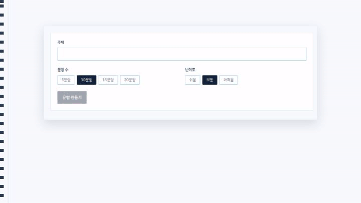
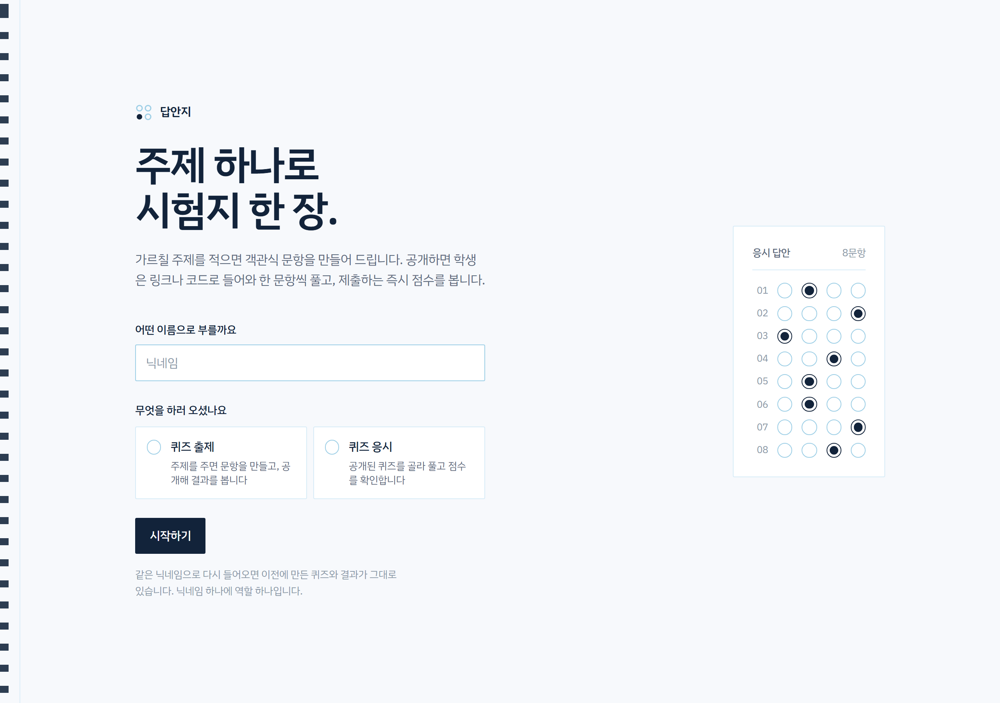
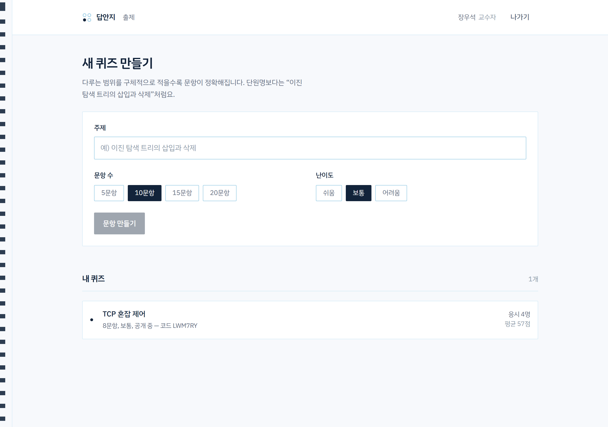
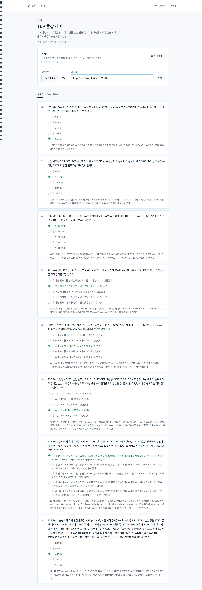
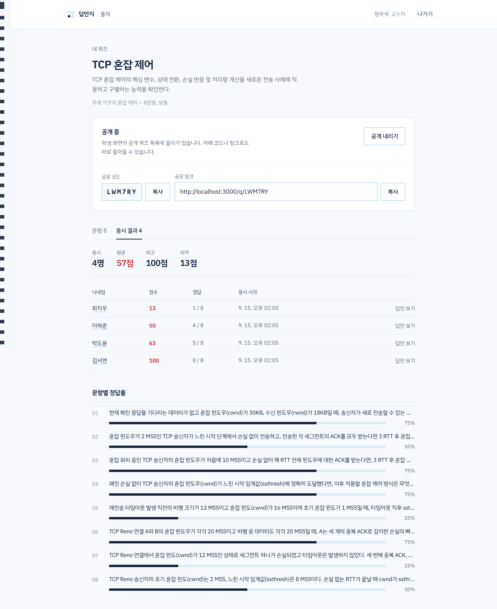
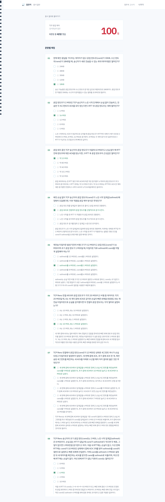
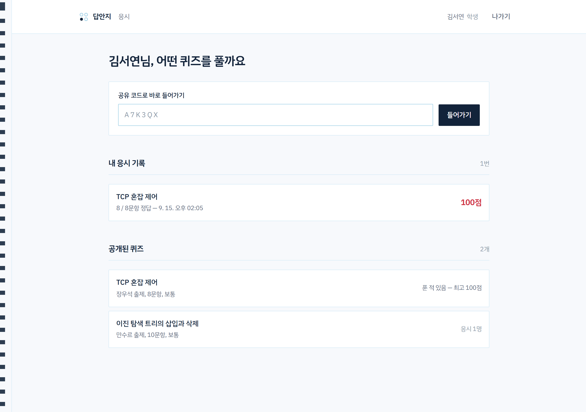
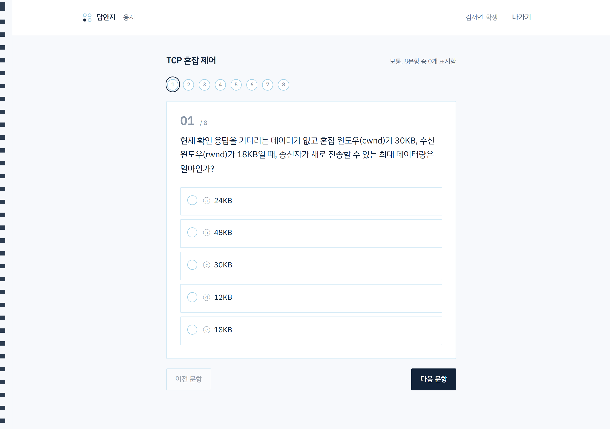
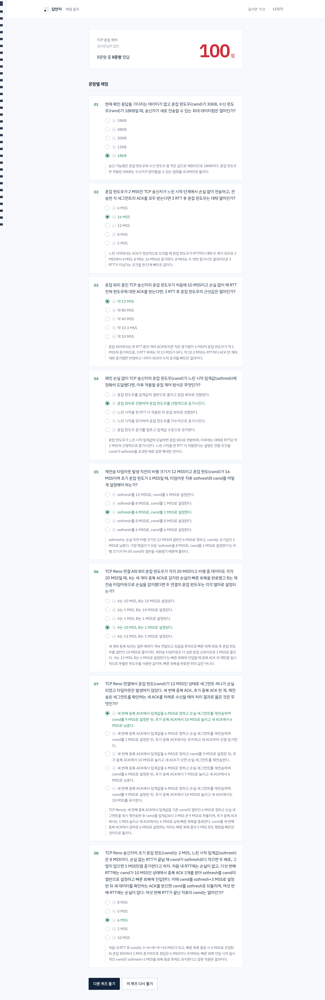

# 답안지

[](docs/video/intro.mp4)

*움직이는 그림을 누르면 35초 전체 영상이 열립니다.*

주제를 입력하면 객관식 문항을 만들어 주고, 공개하면 학생이 한 문항씩 풀어 바로 점수를
확인하는 퀴즈 사이트입니다. 2026년 EBS 신규사원 연수과정 실습 결과물입니다.

- **Next.js 16** (App Router) + TypeScript + Tailwind v4
- **Neon Postgres** (`@neondatabase/serverless`)
- **OpenAI** 문항 생성 (structured outputs, 병렬 생성)
- **Vercel** 배포



닉네임을 적고 교수자와 학생 중 하나를 고르면 들어갑니다. 닉네임이 곧 계정이라 같은
이름으로 다시 오면 어느 브라우저에서든 만들던 퀴즈가 그대로 있습니다.

## 화면

### 출제 — 주제만 주면 문항이 나옵니다



주제·문항 수·난이도를 넣으면 5지선다 문항을 만들어 줍니다. 아래에는 내가 만든 퀴즈가
응시 인원·평균과 함께 쌓입니다.



만들어진 문항은 정답과 해설까지 같이 확인할 수 있습니다. 공개로 돌리면 공유 코드와
링크가 생기고, 학생 화면의 목록에도 올라갑니다.

### 결과 — 반 전체와 학생 한 명을 같은 자리에서



응시 인원·평균·최고·최저와 응시자별 점수, 그리고 문항별 정답률까지 봅니다. 어느 문항이
무너졌는지가 한눈에 들어옵니다.



응시자 이름을 누르면 그 학생이 각 문항에 **무엇을 골랐는지** 정답과 나란히 놓고 볼 수
있습니다. 초록이 정답, 빨강이 그 학생이 고른 오답입니다.

### 응시 — 한 화면에 한 문항



학생은 지난 응시 기록을 먼저 봅니다. 아래 공개된 퀴즈 목록에서는 이미 푼 퀴즈에 최고
점수가 함께 붙습니다. 공유 코드로 바로 들어갈 수도 있습니다.



한 번에 한 문항씩, 위의 번호를 눌러 자유롭게 오갈 수 있습니다. 표시한 문항과 남은 문항이
구분돼 보입니다.



제출하는 즉시 점수가 나오고, 문항마다 내가 고른 답과 정답, 해설을 함께 봅니다.

## 시작하기

### 1. 환경 변수

`.env.example`을 `.env.local`로 복사하고 값을 채웁니다.

| 변수 | 설명 |
| --- | --- |
| `DATABASE_URL` | Neon 콘솔 → Connection Details → **Pooled connection** 문자열 |
| `DATABASE_URL_UNPOOLED` | (선택) 풀러를 거치지 않는 직접 연결 |
| `OPENAI_API_KEY` | https://platform.openai.com/api-keys |
| `OPENAI_MODEL` | (선택) 기본값 `gpt-4o-mini`. 운영은 `gpt-5.6-sol` |

Vercel Marketplace에서 Neon을 연동하면 `DATABASE_URL`은 자동으로 주입됩니다.

```bash
npm i -g vercel          # 아직 없다면
vercel link
vercel integration add neon
vercel env pull .env.local
```

### 2. 테이블 만들기

```bash
npm run db:init
```

`src/lib/schema.sql`을 실행합니다. 모든 구문이 `if not exists`이거나 멱등이라 여러 번
돌려도 안전합니다.

### 3. 개발 서버

```bash
npm run dev          # http://localhost:3000
npm run check:accounts   # 계정·역할·권한 회귀 테스트 (dev 서버가 떠 있어야 합니다)
```

## 흐름

```
/                     닉네임을 적고 교수자 / 학생 선택 (닉네임이 곧 계정)
│
├── /teacher          주제·문항 수·난이도를 넣고 문항 생성, 내 퀴즈 목록
│   └── /teacher/[id] 문항 확인(정답 포함), 공개/비공개 전환, 공유 코드·링크
│       │             응시자별 점수, 문항별 정답률
│       └── .../attempt/[attemptId]
│                     학생 한 명의 답안지 — 무엇을 골랐는지 정답과 나란히
│
├── /student          내 응시 기록, 공개된 퀴즈 목록, 공유 코드로 바로 들어가기
│
├── /q/[code]         응시 — 한 화면에 한 문항, 이전/다음 자유 이동
│                     (링크로 처음 온 사람은 여기서 닉네임을 정합니다)
│
└── /result/[id]      점수와 문항별 채점, 정답과 해설
```

## API

| 메서드 | 경로 | 하는 일 |
| --- | --- | --- |
| `POST` | `/api/session` | 닉네임으로 계정을 찾거나 만듭니다 (로그인) |
| `GET` | `/api/quizzes?scope=published` | 공개된 퀴즈 목록 |
| `GET` | `/api/quizzes?scope=mine&ownerId=` | 내가 만든 퀴즈 목록 |
| `POST` | `/api/quizzes` | 문항을 생성해 저장 (**교수자만**) |
| `GET` | `/api/quizzes/:id?ownerId=` | 출제자용 상세 (정답 포함) |
| `PATCH` | `/api/quizzes/:id` | 공개 / 비공개 전환 |
| `DELETE` | `/api/quizzes/:id?ownerId=` | 삭제 |
| `GET` | `/api/quizzes/:id/results?ownerId=` | 응시 결과와 문항별 정답률 |
| `GET` | `/api/quizzes/code/:code` | 응시자용 퀴즈 (**정답 제외**) |
| `POST` | `/api/attempts` | 서버에서 채점하고 응시 기록 저장 (**학생만**) |
| `GET` | `/api/attempts?userId=` | 그 학생의 응시 기록 (**본인만**) |
| `GET` | `/api/attempts/:id?viewerId=` | 채점 답안지 (**본인과 출제자만**) |

## 설계 메모

### 정답은 서버 밖으로 나가지 않습니다

`/api/quizzes/code/:code`가 내려주는 문항에는 `answerIndex`가 없고, 채점은
`POST /api/attempts`에서 DB의 정답과 대조해 이뤄집니다. 점수도 클라이언트가 보낸 값을
쓰지 않고 서버가 계산합니다. 정답이 들어 있는 채점 답안지는 본인과 출제자만 읽을 수
있습니다.

### 닉네임이 계정입니다

`users` 테이블에 닉네임(대소문자·앞뒤 공백 무시)을 키로 계정을 두고, `userId`는 서버가
발급합니다. 같은 이름으로 들어오면 어느 브라우저에서든 같은 계정이라 만든 퀴즈가 따라
옵니다.

한 계정은 한 역할입니다. 이미 쓰인 이름을 반대쪽 역할로 요청하면 거부하고, 페이지 가드와
서버 API가 역할을 각각 확인합니다.

비밀번호는 없습니다. 남의 닉네임을 적으면 그 계정으로 들어갈 수 있으므로, 실습 범위를
넘어 쓰려면 실제 인증을 붙이는 것이 다음 단계입니다.

### 문항은 병렬로 씁니다

한 번의 호출로 열 문항을 쓰면 92초가 걸립니다. 나눠서 동시에 쓰면 되지만 각 호출이 서로를
못 보므로 그냥 나누면 같은 것을 두 번 묻게 됩니다. 그래서 두 단계로 나눴습니다.

1. 주제를 겹치지 않는 확인 지점 N개로 먼저 나눕니다 (제목·설명도 여기서).
2. 각 지점을 맡은 호출을 동시에 띄워 문항을 하나씩 쓰게 합니다.

측정(10문항): 한 번에 92초 → 3개씩 49초 → **1개씩 27초**. 20문항은 52초입니다.
`maxDuration`은 300초입니다.

정답 위치 분산은 서버가 맡습니다. 각 호출이 자기 문항만 보기 때문에 모델은 퀴즈 전체를
놓고 흩을 수 없습니다. 다섯 자리에 고르게 배정하고 오답 순서도 다시 섞습니다. 이 때문에
해설에서는 선택지를 기호가 아니라 내용으로 가리키게 했습니다.

## 소개영상

맨 위의 영상은 [Remotion](https://www.remotion.dev/)으로 만듭니다. `video/`가 자체
`package.json`을 들고 있어 앱 의존성과 섞이지 않고, 배포 번들에도 들어가지 않습니다.

```bash
cd video
npm install
npm run studio     # 미리보기 (http://localhost:3000)
npm run build      # docs/video/intro.mp4 와 intro.gif
```

화면은 새로 찍지 않고 `docs/screenshots/`의 캡처를 그대로 씁니다. Remotion의
`publicDir`이 `../docs`를 가리키고 있어 사본을 두지 않으며, 버블이 채워지거나 빨간펜이
그어지는 부분만 벡터로 그 위에 얹습니다. 캡처를 다시 찍으면 `video/src/scenes/*.tsx`
위쪽에 적어 둔 좌표(캡처 원본 픽셀 기준)를 함께 맞춰야 합니다.

Remotion은 MIT가 아닙니다. 개인과 직원 3인 이하 영리법인, 비영리 조직은 무료이고, 그
밖의 영리조직은 회사 라이선스가 필요합니다 — https://www.remotion.pro/license

## 배포

```bash
vercel deploy --prod
```

Neon 연동과 `OPENAI_API_KEY`, `OPENAI_MODEL`을 Vercel 프로젝트 환경 변수에 넣은 뒤,
`npm run db:init`을 한 번 실행하거나 Neon SQL Editor에 `src/lib/schema.sql`을 붙여
넣으면 됩니다.
